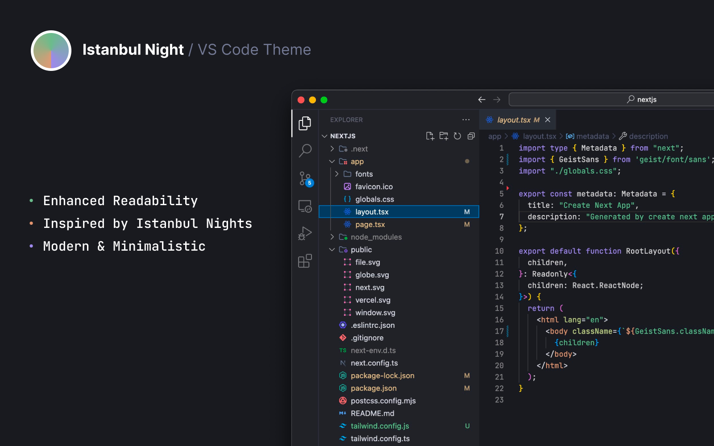

# Istanbul Night VS Code theme

## Install

1. Go to [VS Marketplace](https://marketplace.visualstudio.com/items?itemName=GitHub.github-vscode-theme).
2. Click on the "Install" button.
3. Then [select a theme](https://code.visualstudio.com/docs/getstarted/themes#_selecting-the-color-theme). The GitHub themes try to match the themes available in [github.com's settings](https://github.com/settings/appearance):
    - `Istanbul Night`